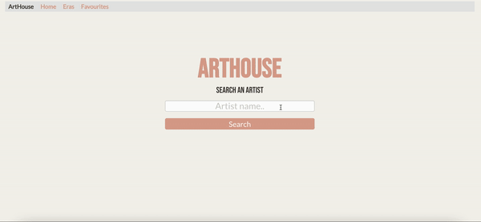
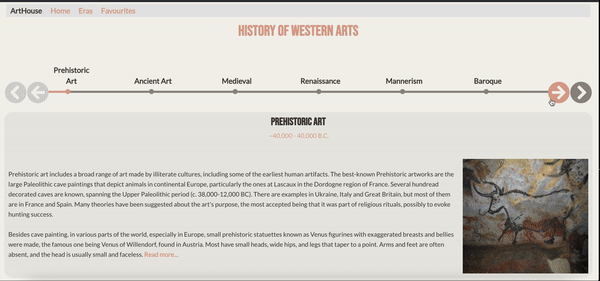

          

# ArtHouse Project
---

### Main Feature Demo

### Era Feature Demo

## Description

ArtHouse is an app for the artist lovers. The aim of this project is to create a one-stop space to find an artist's body of work and biography, as well as have the ability to save their favourite artworks, which will presist after every visit to the website. Moreover, the era-feature allows the user to search the entire History of Western Art using the timeline carousel at the top of the page. Each section will provide the user a brief information of that specific era and its major contributors, along with an image and a wiki link. 

Link to the [site](https://raimeeab.github.io/arthouse-project)

## User Story 

### Main Feature
As a user,  
WHEN I search an artist’s name,  
THEN I am presented with the artists body of work and a  biography.  
GIVEN I press on the favourite button, 
THEN the artwork is saved in the favourites tab.  

### Era Timeline Feature
As a user,  
WHEN I press on the eras tab on the nav bar,  
THEN I am presented with a timeline of the entire history of Western Arts. 
Given I press on the “read more” link, 
THEN I am taken to the related wiki page. 

## Technologies used 

- JavaScript
- jQuery 
- Jsdilvr library
- CSS
- Foundation CSS
- Artic API
- Wiki  API
- HTML 5

## Usage 

User can search any artist in history and will be presented with their body of work and a brief biography. They are given the ability to favourite specifc pieces which will be saved and displayed in the favourites page. The era feature always users to find information about every major movement in Western Art History, as well as leading contributors and influenctial artworks. 

- The user is also able to remove any of the artworks from their local storage by clicking the star button again 

## Contributors

*[Raimee Abbassi](https://github.com/Raimeeab)*  
*[Kaushik Patel](https://github.com/kashpateltech)*  
*[Shaotang Yen](https://github.com/shaotangyen)*  
*The Univserity of Sydney | Trilogy Education Services*  

## License 

MIT License
Copyright (c) [2021] [ArtHouse]
Permission is herby granted, free of charge, to any person obtaining a copy of this software and associated documentation files (the "Software"), to deal in the Software without restriction, including without limiation the rights to use, copy, modify, merge, publish, distribute, sublicense, and/or sell copies of the Software, and to permit persons to whom the Software is furnished to do so, subject following coditions: 
The above copyright notice and this permission notice shall be included in all copies or substantial portions of the Software. 

THE SOFTWARE IS PROVIDED "AS IS", WITHOUT WARRANTY OF ANY KIND, EXPRESS OR IMPLIED, INCLUDING BUT NOT LIMITED TO THE WARRANTIES OF MECHANTABILITY, FITNESS FOR A PARTICULAR PURPOSE AND NONINFRINGEMENT. IN NO EVENT SHALL THE AUTHORS OR COPYRIGHT HOLDERS BE LIABLE FOR ANY CLAIM, DAMAGES OR OTHER LIABILITY, WHETHER IN AN ACTION OF CONTRACT, TORT OR OTHERWISE, ARISING FROM, OUT OF OR IN CONNECTION WITH THE SOFTWARE OR THE USE OF OTHER DEALINGS IN THE SOFTWARE.  